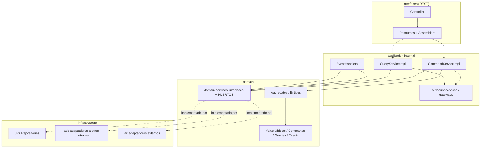
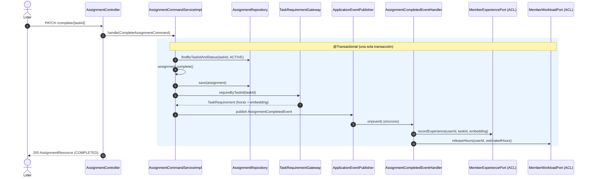
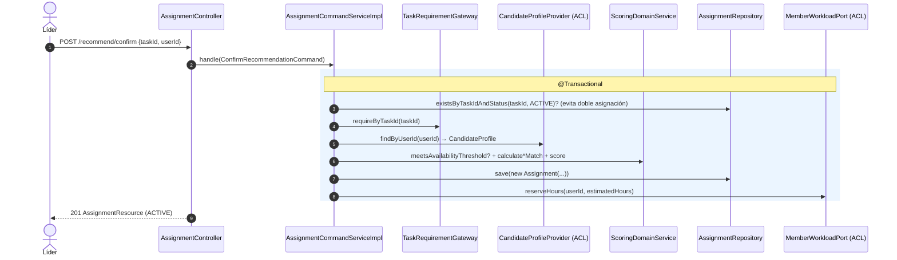
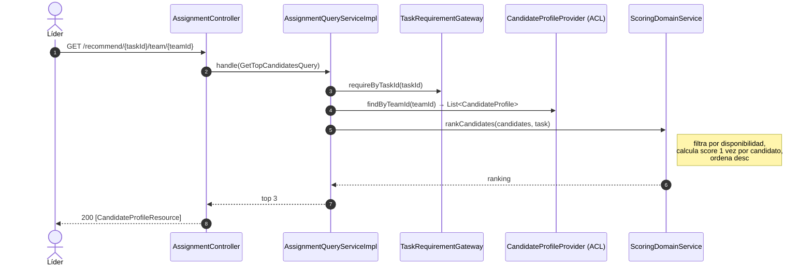
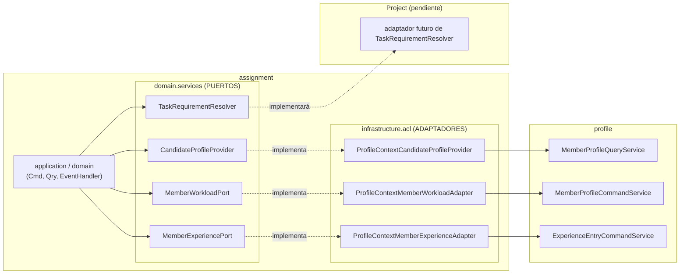

# backend-plannia

Backend del sistema **Plannia**: asigna a los miembros **más aptos** a sus tareas usando
*embeddings* (similitud semántica entre el perfil del miembro y los requisitos de la tarea)
y la **carga horaria** disponible de cada miembro.

- **Stack:** Spring Boot 4 · Java 25 · Spring Data JPA (PostgreSQL) · Spring AI (modelo de
  embeddings local vía API compatible con OpenAI, p. ej. LM Studio / Ollama).
- **Arquitectura:** DDD por *bounded contexts*, cada uno en 4 capas
  (`domain` → `application` → `infrastructure` / `interfaces`).

> El proyecto contempla **5 bounded contexts**. Implementados: **`profile`** (perfil del
> miembro) y **`assignment`** (asignación). Pendientes: **IAM** (usuarios/equipos),
> **Project** (tareas/categorías) y **Notification** (correo, p. ej. Brevo).

---

## Índice

1. [Arquitectura en capas](#arquitectura-en-capas)
2. [Flujos implementados (correcciones A, B, C)](#flujos-implementados)
   - [A. Completar asignación → experiencia + liberar carga (evento)](#a-completar-asignación)
   - [Reservar carga al confirmar una recomendación](#reservar-carga-al-confirmar)
   - [Ranking de candidatos (top 3)](#ranking-de-candidatos)
   - [B. Capa anticorrupción (ACL) entre contextos](#b-capa-anticorrupción-acl)
   - [C. Notas de calidad (transacciones, tipos, scoring)](#c-notas-de-calidad)
3. [Cómo implementar un bounded context nuevo](#cómo-implementar-un-bounded-context-nuevo)

---

## Arquitectura en capas

Cada *bounded context* repite la misma estructura. Las dependencias **solo apuntan hacia
adentro**: `interfaces` e `infrastructure` dependen de `application`, que depende de `domain`.
El `domain` no depende de nada de Spring/JPA.



**Responsabilidad de cada capa**

| Capa | Contiene | Regla |
|------|----------|-------|
| `domain` | Aggregates, entities, value objects, commands, queries, events, **read models** de otros contextos, e **interfaces** de servicios y **puertos** (`*Resolver`, `*Provider`, `*Port`). | Sin dependencias de framework. Aquí vive la lógica de negocio. |
| `application.internal` | `*CommandServiceImpl`, `*QueryServiceImpl`, `eventhandlers` (`@EventListener`) y `outboundservices` (gateways). Orquesta el dominio. | Aquí va `@Transactional`. |
| `infrastructure` | `persistence.jpa.repositories`, `acl` (adaptadores que **consumen otros contextos**) y `ai` (adaptadores externos). | **Único lugar** que puede importar tipos de otro bounded context. |
| `interfaces.rest` | `Controller`, `resources` (DTO de entrada/salida) y `transform` (assemblers DTO ↔ command/entity). | Sin lógica de negocio; solo traduce HTTP. |

---

## Flujos implementados

Endpoints del contexto `assignment`:

| Método | Ruta | Acción |
|--------|------|--------|
| `GET`  | `/api/v1/assignments/recommend/{taskId}/team/{teamId}` | Top 3 candidatos para una tarea |
| `POST` | `/api/v1/assignments/recommend/confirm` | Confirmar la recomendación → crea asignación |
| `PATCH`| `/api/v1/assignments/complete/{taskId}` | Completar la asignación activa de una tarea |
| `GET`  | `/api/v1/assignments/users/{userId}` | Asignaciones de un miembro |

### A. Completar asignación

Política del *event storming*: *"Cuando se completa una tarea, se actualiza la experiencia del
miembro asignado"* — y, además, se **libera su carga horaria**.

Al completar, el servicio publica un **evento** que lleva las horas estimadas y el *embedding*
de la tarea (ambos resueltos desde el contexto Project). Un `@EventListener` **síncrono**
corre **dentro de la misma transacción** (`@Transactional`): si algo falla, todo revierte junto.



> `recordExperience` guarda una `ExperienceEntry` **y** recalcula el promedio del *embedding* de
> experiencia del miembro. Antes de esta corrección el evento se publicaba pero **nadie lo
> escuchaba**, así que la experiencia nunca se actualizaba (el 35 % del peso del *score* quedaba en 0).

### Reservar carga al confirmar

Al confirmar una recomendación se crea la asignación y se **reserva** la carga del miembro
(`reserveHours`). Antes, `activeHours` nunca subía, por lo que la verificación de disponibilidad
era ficticia (un miembro podía recibir asignaciones infinitas).



### Ranking de candidatos



El *score* combina tres similitudes coseno ponderadas (`AssignmentScoreWeights`):

```
score = 0.55 · skillMatch + 0.35 · experienceMatch + 0.10 · interestMatch
```

### B. Capa anticorrupción (ACL)

`assignment` **no** importa tipos de `profile` en su dominio/aplicación. En su lugar define
**puertos** (interfaces en su propio lenguaje) en `domain.services`, y unos **adaptadores** en
`infrastructure.acl` los implementan delegando en la **API pública** de `profile` (sus
*command/query services*, nunca sus repositorios). Así, si `profile` cambia por dentro, solo se
toca el adaptador.



`TaskRequirementResolver` ya es un puerto que `assignment` define pero **aún no tiene
implementación** (depende del contexto Project). Por eso `TaskRequirementGateway` usa un
`ObjectProvider` y lanza un error claro si el adaptador no está presente. **Al implementar
Project, su tarea es proveer ese adaptador** (devuelve el *embedding* de la descripción de la
tarea + las horas estimadas).

### C. Notas de calidad

- **`@Transactional`**: agrupa varias escrituras en una transacción (todo confirma o revierte
  junto). Está en `confirm`/`complete` (assignment) y en `AddExperienceEntry` (profile, que
  escribe entrada + perfil). *No* se puso en los `create/update` de perfil porque hacen una sola
  escritura **y** llaman a la IA de *embeddings*: envolverlos mantendría la conexión a BD abierta
  durante la llamada HTTP al modelo.
- **Evento síncrono**: un `@EventListener` normal se ejecuta en el hilo y la transacción del
  publicador → por eso `complete` es atómico de punta a punta.
- **Tipos de horas**: `maxHours`/`activeHours` y las operaciones de carga son `float`
  (`estimatedHours` de la tarea es `int` y se ensancha solo).
- **Scoring eficiente**: `rankCandidates` precalcula el *score* una vez por candidato (antes el
  `Comparator` lo recomputaba en cada comparación, con similitudes coseno sobre vectores de ~768
  dimensiones).

---

## Cómo implementar un bounded context nuevo

Sigue **siempre** la misma estructura de paquetes (ejemplo para un contexto `xyz`):

```
upc/com/pe/backendplannia/xyz/
├── domain/
│   ├── model/
│   │   ├── aggregates/        Raíz del agregado (extiende AuditableAbstractAggregateRoot)
│   │   ├── entities/          Entidades hijas (extiende AuditableModel)
│   │   ├── valueobjects/      Value objects / enums
│   │   ├── commands/          CreateXCommand, UpdateXCommand, ...
│   │   ├── queries/           GetXByIdQuery, GetAllXQuery, ...
│   │   ├── events/            XHappenedEvent (records)
│   │   └── readmodels/        Datos que llegan de OTROS contextos (records)
│   └── services/              Interfaces: XCommandService, XQueryService + PUERTOS (a otros contextos)
├── application/
│   └── internal/
│       ├── commandservices/   XCommandServiceImpl   (@Service, @Transactional si hay >1 escritura)
│       ├── queryservices/     XQueryServiceImpl
│       ├── eventhandlers/     XEventHandler         (@Component + @EventListener)
│       └── outboundservices/  Gateways/fachadas hacia puertos externos
├── infrastructure/
│   ├── persistence/jpa/repositories/   XRepository extends JpaRepository
│   ├── acl/                   Adaptadores que implementan PUERTOS consumiendo otros contextos
│   └── ai/ (u otro)           Adaptadores a servicios externos
└── interfaces/
    └── rest/
        ├── resources/         CreateXResource (valida en el constructor), XResource (salida)
        ├── transform/         Assemblers: Resource → Command, Entity → Resource
        └── XController        (@RestController, /api/v1/...)
```

### Convenciones

- **Aggregate**: constructor `protected` vacío (para JPA) + constructor que recibe el *command*.
  La mutación va por **métodos de dominio** que validan invariantes (no *setters*).
- **Command/Query/Event/ReadModel**: `record` inmutable. Los servicios exponen `handle(...)`
  sobrecargado por tipo de command/query.
- **Resources**: validan en el *compact constructor* (`if (... ) throw new IllegalArgumentException`).
- **Assemblers**: clases con métodos `static` (`toCommandFromResource`, `toResourceFromEntity`).
- **Auditoría/ID**: hereda de `shared.domain.model.aggregates.AuditableAbstractAggregateRoot`
  (agregados, da `id` + `createdAt`/`updatedAt` + eventos) o `AuditableModel` (entidades hijas).
- **Tablas**: el `SnakeCaseWithPluralizedTablePhysicalNamingStrategy` pluraliza y usa snake_case
  automáticamente.

### Comunicación entre contextos (regla de oro)

Un contexto **nunca** importa el `domain`/`infrastructure` de otro desde su propio
`domain`/`application`. Para integrarte:

1. **Si consumes a otro contexto** (necesitas leer/escribir datos suyos):
   define un **puerto** en *tu* `domain.services` (`XProvider` / `XPort`) que hable en tu
   lenguaje y use tus *read models*; impleméntalo con un **adaptador** en *tu*
   `infrastructure.acl` que delegue en la **API pública** (command/query services) del otro
   contexto. *(Ver `assignment` → `profile`.)*
2. **Si reaccionas a algo que pasó en otro contexto**:
   publica un **evento de dominio** (`ApplicationEventPublisher`) y escúchalo con un
   `@EventListener`. *(Ver `AssignmentCompletedEvent`.)*

### Checklist al crear un contexto

1. Modela el `domain` (aggregate + value objects + commands/queries/events).
2. Define las interfaces `XCommandService` / `XQueryService` en `domain.services`.
3. Implementa `application.internal.*ServiceImpl` (añade `@Transactional` donde haya varias escrituras).
4. Crea el `XRepository` en `infrastructure.persistence`.
5. Si te integras con otro contexto, añade **puerto + adaptador ACL** y/o **evento + handler**.
6. Expón `interfaces.rest` (resource → assembler → command/query → resource).
7. Tests: de aplicación con *mocks* de repos/puertos (sin BD) y, si aplica, de integración.

### Próximos contextos y su encaje

- **Project (Task/Category)** → debe implementar el puerto `TaskRequirementResolver` de
  `assignment` (adaptador en `assignment.infrastructure.acl` o expuesto por Project), devolviendo
  el *embedding* de la tarea + horas estimadas. Reusa `ProfileEmbeddingService` para los *embeddings*.
- **IAM (User/Team)** → autenticación, equipos y `userId`/`teamId` que hoy `profile`/`assignment`
  reciben como números. Publica eventos al eliminar miembros (política "miembro retirado").
- **Notification** → escucha eventos (`AssignmentCompletedEvent`, etc.) y envía correos (Brevo)
  vía un adaptador en su `infrastructure`.

---

## Gantt en Google Sheets

Integración opcional para generar un diagrama Gantt por categoría en Google Sheets.

### Variables de entorno

| Variable | Default | Descripción |
|----------|---------|-------------|
| `GANTT_GOOGLE_ENABLED` | `false` | `true` usa Google API real; `false` usa adapter de log |
| `GANTT_GOOGLE_CREDENTIALS_JSON` | vacío | JSON de service account (Workspace + Shared Drive) |
| `GANTT_OAUTH_CLIENT_ID` | vacío | OAuth Client ID (Gmail personal) |
| `GANTT_OAUTH_CLIENT_SECRET` | vacío | OAuth Client Secret (Gmail personal) |
| `GANTT_OAUTH_REFRESH_TOKEN` | vacío | Refresh token del Gmail que posee la carpeta Gantt |
| `GANTT_SHEET_ID` | vacío | ID de plantilla opcional (ya no es necesaria para crear) |
| `GANTT_OUTPUT_FOLDER_ID` | vacío | ID de carpeta en Drive donde se crean las hojas Gantt |

Estas variables se inyectan como **App Settings / variables de entorno**; Spring las aplica por relaxed binding (`GANTT_GOOGLE_ENABLED` → `gantt.google.enabled`, etc.). No van en `application.properties`.

### Modo A — Gmail personal (`@gmail.com`)

Las service accounts **no** pueden guardar en Mi unidad. Usa **OAuth de usuario** (una sola vez) y el backend desplegado guarda el refresh token en Azure.

#### A.1 Crear cliente OAuth **Web** en Google Cloud

1. **Credenciales → Crear cliente OAuth → Aplicación web**
2. **URI de redirección autorizados** (exacto):

```
https://plannia-eabkf7dna7g7dqhc.eastus-01.azurewebsites.net/api/v1/gantt/oauth/callback
```

3. Añade tu Gmail en **Usuarios de prueba** (pantalla de consentimiento).

#### A.2 Variables en Azure (antes del refresh token)

| Variable | Valor |
|----------|-------|
| `GANTT_OAUTH_CLIENT_ID` | Client ID (app web) |
| `GANTT_OAUTH_CLIENT_SECRET` | Client Secret |
| `GANTT_OAUTH_REDIRECT_URI` | misma URL de callback de arriba |
| `GANTT_OAUTH_SETUP_SECRET` | una contraseña larga aleatoria (ej. `plannia-setup-2026-xK9m`) |
| `GANTT_OUTPUT_FOLDER_ID` | `1Swj_mLlnbaDBoAZCOJN8-X1W_88qYbvC` |

Redespliega el backend.

#### A.3 Autorizar desde el navegador (una vez)

Abre en el navegador (sustituye `TU_SECRETO`):

```
https://plannia-eabkf7dna7g7dqhc.eastus-01.azurewebsites.net/api/v1/gantt/oauth/authorize?secret=TU_SECRETO
```

Inicia sesión con tu Gmail → al terminar verás el **refresh token** en pantalla.

#### A.4 Completar Azure

| `GANTT_OAUTH_REFRESH_TOKEN` | el token mostrado |
| `GANTT_GOOGLE_ENABLED` | `true` |

Reinicia Azure. **Generar Gantt** en `https://plannia-phi.vercel.app` ya usará tu Drive.

Alternativa local: `GanttOAuthTokenSetup` con cliente **de escritorio** (sin desplegar).

Puedes **eliminar** `GANTT_GOOGLE_CREDENTIALS_JSON` en este modo.

### Modo B — Google Workspace (Shared Drive)

| `GANTT_GOOGLE_CREDENTIALS_JSON` | JSON de service account |
| `GANTT_OUTPUT_FOLDER_ID` | carpeta dentro de una **Unidad compartida** |

Añade la service account como **Colaborador de contenido** en la unidad compartida.

**Cuota de Drive (solo modo B):** si aparece `storageQuotaExceeded`, la carpeta no está en Shared Drive o la service account no tiene permisos.

El scheduler sincroniza todos los días a las **12:00** (`America/Lima`).

### Endpoint

```
POST /api/v1/categories/{categoryId}/gantt
```

Devuelve `CategoryResource` con `ganttSpreadsheetUrl`. Requiere al menos un miembro en la categoría.

### Setup GCP (resumen)

1. Habilitar Google Sheets API y Google Drive API.
2. Crear service account y descargar clave JSON.
3. Configurar `GANTT_GOOGLE_CREDENTIALS_JSON` en local/Azure (no commitear).
